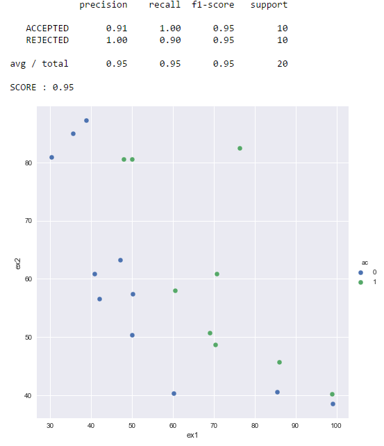

### Reto basico - Admisiones
Solución para el reto básico de admisiones propuesto en el taller de [colomb-ia](https://github.com/charlielito/supervised-basico-admission-exams).

#### Requirements
 - Python > 2.5

#### Procedure
Run:

 ```
     $>git clone repo
     $>cd repo
     $>python -r requirements.txt
     $>python sklearn_logistic_regression.py 
 ```

#### Method
Using out of the box logistic regression with sklearn yields results scoring < 0.90 since its trying to use a line as a decision boundary. Using non linear terms, more specifically, quadradict terms gives better results.

#### Results
